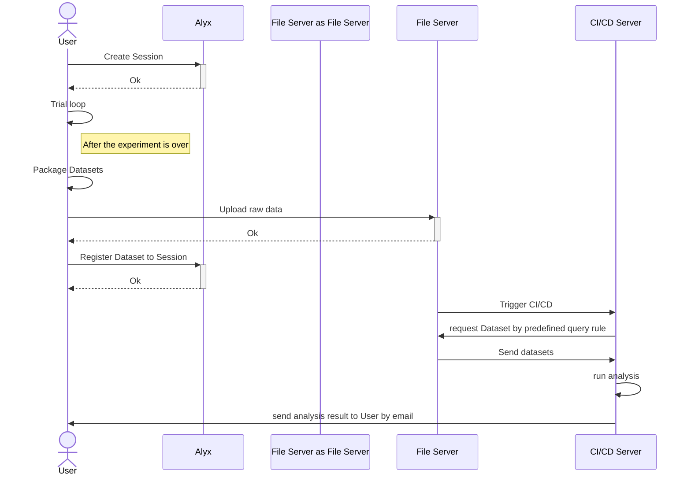
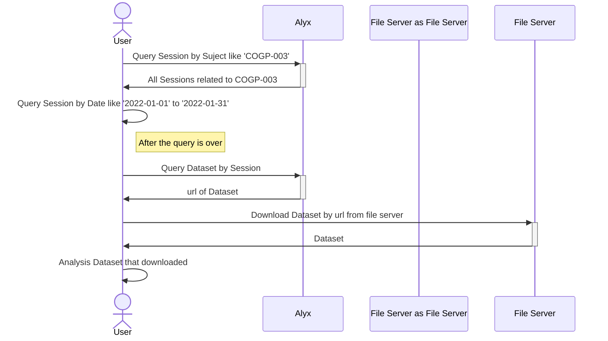

## Alyx demo

A simple example of the Alyx workflow

## Get start
```bash
git clone https://github.com/Ccccraz/alyx_demo.git

cd alyx_demo

conda env create -n alyx_demo python=3.9

conda activate alyx_demo

pip install .
```

or with uv:
```bash
git clone https://github.com/Ccccraz/alyx_demo.git

cd alyx_demo

uv sync
```

## Workflow
First, check out the `setup_alyx.ipynb` file. If you are using Alyx for the first time, this step will complete the global settings of Alyx.

Then, check out the `gen_data.ipynb` file. This file shows the full workflow of connecting to Alyx, creating a session, generating mock data, and uploading it to our samba server and establishing a connection with Alyx.

- Typically, the workflow is as follows:


Finally, check out the `get_data.ipynb` file. This file shows how to retrieve experiments from Alyx and download the associated datasets.

- A typical data consumption workflow:
